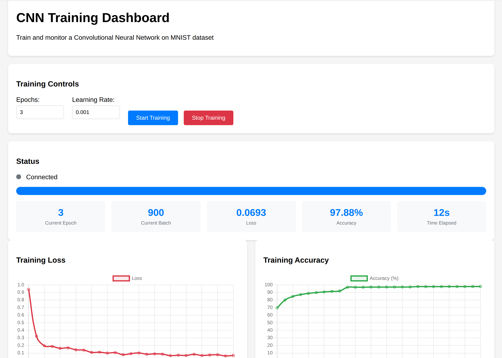

# CNN Training Dashboard

A real-time web dashboard for training and testing Convolutional Neural Networks on the MNIST dataset. Features live training metrics, interactive charts, and image classification with both file upload and drawing canvas.

<p align="center">
  
</p>

> 🤖 **This entire project was live-coded with Claude on the server!** Check out [CLAUDE.md](CLAUDE.md) to see the prompting session that built this from scratch.

   

## Features

- 🚀 **Real-time Training**: Start/stop CNN training with live loss and accuracy updates
- 📊 **Interactive Charts**: Live plots of training metrics using Chart.js
- 🖼️ **Image Classification**: Upload images or draw digits for classification
- 🎨 **Drawing Canvas**: Draw digits directly in the browser for testing
- ⚡ **GPU Acceleration**: Automatic CUDA support when available
- 🔧 **WebSocket Integration**: Real-time updates via Socket.IO

## Architecture

- **Backend**: Flask + PyTorch + Socket.IO for real-time ML training
- **Frontend**: Vanilla JavaScript with Chart.js for visualization
- **Model**: Simple CNN (2 conv layers + 2 FC layers) trained on MNIST

## Quick Start

### Prerequisites

- Python 3.8+
- CUDA-capable GPU (optional, will use CPU if not available)

### Backend Setup

1. Navigate to the backend directory:
```bash
cd backend
```

2. Install dependencies:
```bash
# Using pip
pip install -r requirements.txt

# Or using uv (recommended)
uv sync
```

3. Start the backend server:
```bash
python app.py
```

The server will start on `http://localhost:5000` with GPU/CPU auto-detection.

### Frontend Setup

1. Open `frontend/index.html` in a web browser
2. **Configure Backend URL**: Edit line 257 in `index.html`:
```javascript
const BACKEND_URL = 'http://localhost:5000'; // Change this to your backend URL
```

For remote servers, update to your server's address:
```javascript
const BACKEND_URL = 'http://your-server-ip:5000';
```

## Usage

### Training a Model

1. Open the web interface
2. Set training parameters (epochs, learning rate)
3. Click "Start Training"
4. Monitor real-time loss and accuracy charts
5. Model automatically saves as `mnist_cnn.pth` when complete

### Classifying Images

1. Click "Load Saved Model" after training
2. **Upload Method**: Choose an image file (automatically resized to 28x28)
3. **Drawing Method**: Draw a digit on the canvas
4. Click "Classify" to get predictions with confidence scores

## API Endpoints

| Endpoint | Method | Description |
|----------|--------|-------------|
| `/api/start_training` | POST | Start model training |
| `/api/stop_training` | POST | Stop ongoing training |
| `/api/predict` | POST | Classify uploaded image |
| `/api/load_model` | POST | Load saved model |
| `/api/status` | GET | Get training status |
| `/api/history` | GET | Get training history |

## WebSocket Events

- `training_status` - Training start/stop notifications
- `training_update` - Real-time metrics (loss, accuracy, epoch)
- `epoch_complete` - Epoch completion updates  
- `training_complete` - Final results with test accuracy

## Model Architecture

```python
SimpleCNN(
  (conv1): Conv2d(1, 32, kernel_size=3, padding=1)
  (conv2): Conv2d(32, 64, kernel_size=3, padding=1) 
  (pool): MaxPool2d(kernel_size=2, stride=2)
  (fc1): Linear(3136, 128)
  (fc2): Linear(128, 10)
  (relu): ReLU()
  (dropout): Dropout(p=0.5)
)
```

**Parameters**: ~421K  
**Input**: 28×28 grayscale images  
**Output**: 10 classes (digits 0-9)

## Configuration

### Backend Configuration

Edit `app.py`:
- **Port**: Change `port=5000` in `socketio.run()`
- **Host**: Change `host='0.0.0.0'` to restrict access
- **Model**: Modify `SimpleCNN` class for different architectures

### Frontend Configuration

Edit `frontend/index.html` line 257:
```javascript
const BACKEND_URL = 'http://your-backend-url:5000';
```

## Development

### Project Structure
```
cnn-training-dashboard/
├── backend/
│   ├── app.py              # Flask + Socket.IO server
│   ├── requirements.txt    # Python dependencies
│   └── pyproject.toml     # uv project file
├── frontend/
│   └── index.html         # Complete web interface
├── README.md
└── LICENSE
```

### Adding Features

1. **New Endpoints**: Add routes in `app.py`
2. **Frontend Updates**: Modify `index.html` 
3. **Model Changes**: Update `SimpleCNN` class
4. **Real-time Events**: Add Socket.IO event handlers

## Performance

- **Training Speed**: ~12 seconds for 3 epochs on RTX 3080
- **Accuracy**: ~98% on MNIST test set
- **Memory**: ~2GB GPU memory usage
- **CPU Fallback**: Automatic when CUDA unavailable

## Troubleshooting

### Backend Issues
- **Import Error**: Install missing dependencies with `pip install -r requirements.txt`
- **CUDA Error**: Check GPU availability with `torch.cuda.is_available()`
- **Port Conflict**: Change port in `app.py`

### Frontend Issues  
- **Connection Failed**: Verify `BACKEND_URL` in `index.html`
- **CORS Error**: Backend includes CORS headers for cross-origin requests
- **Socket Disconnect**: Check server logs and network connectivity

### Training Issues
- **Low Accuracy**: Increase epochs or adjust learning rate
- **Memory Error**: Reduce batch size or use CPU
- **Slow Training**: Ensure GPU is available and CUDA installed

## License

This project is licensed under the MIT License - see the [LICENSE](LICENSE) file for details.

## Contributing

1. Fork the repository
2. Create a feature branch (`git checkout -b feature/amazing-feature`)
3. Commit your changes (`git commit -m 'Add some amazing feature'`)
4. Push to the branch (`git push origin feature/amazing-feature`)
5. Open a Pull Request

## Development Inspiration

This project was inspired by [@levelsio's tweet](https://x.com/levelsio/status/1951764854580105453) about the modern development workflow:

📱 **Termius on phone** for SSH access  
🤖 **Claude on server** for vibe coding and self-deployment  
⚡ **Incredibly fast iteration** - from idea to production in minutes

The entire stack runs directly on the GPU server, making development seamless and deployment instant.

## Acknowledgments

- **Claude** for live-coding this entire project on the server 🤖
- [@levelsio](https://x.com/levelsio) for inspiring this mobile-first development approach
- PyTorch team for the ML framework
- Flask and Socket.IO for real-time web capabilities
- Chart.js for beautiful visualizations
- MNIST dataset for training data

---

*This project demonstrates the power of AI-assisted development. The entire codebase, from initial GPU testing to the final web dashboard, was built through natural language conversations with Claude running directly on the server. See [CLAUDE.md](CLAUDE.md) for the complete development story.*